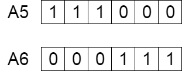
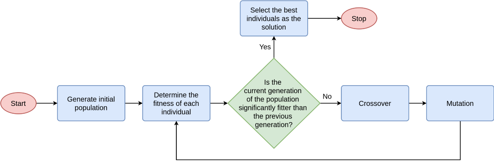
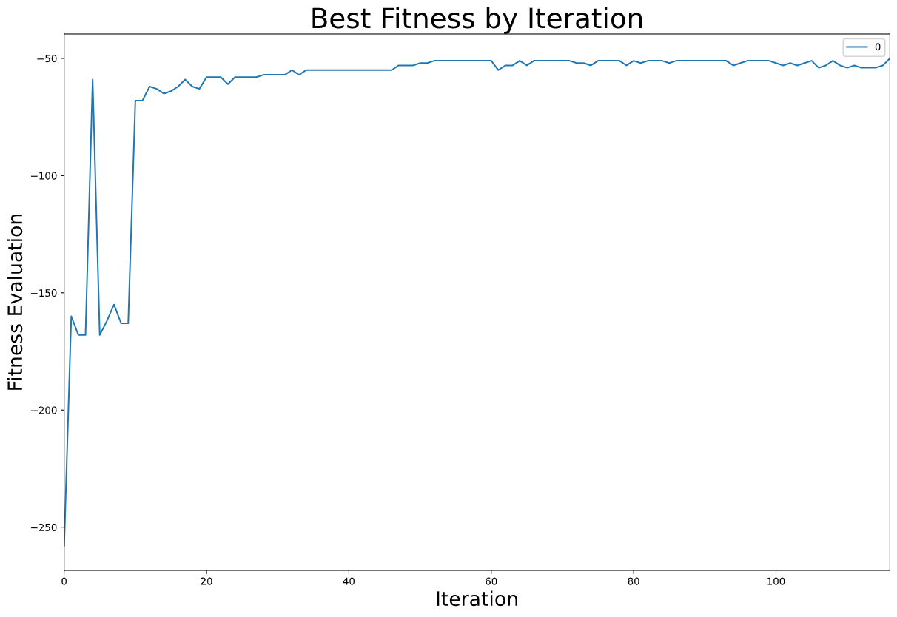

# **Algoritmos Genéticos (Python)**
### **Introducción**: 
Un algoritmo genético es una búsqueda heurística que está inspirada en la teoría natural de la evolución de Darwin. Este algoritmo refleja el proceso de selección natural, donde los individuos más aptos son seleccionados para reproducirse en orden, para producir descendencia de la siguiente generación. 

Esta noción de selección natural puede ser aplicado para resolver problemas. Consideramos que un grupo de soluciones para un problema y seleccionamos al mejor grupo de soluciones de todos ellos. 

Cinco faces son consideradas en un algoritmo genético.  

        Población inicial
        Fitness function
        Selección
        Crossover
        Mutación 

### **Población Inicial**:
EL proceso inicia con un grupo de individuos, los cuales son llamados **Population**. Cada individuo es una solución para resolver el problema que quieres resolver.  
Un individuo es caracterizado por un grupo de parámetros (variables) conocidos como Genes. Los genes son agrupados en cadena para forman un Chromosome (solución)  

En un algoritmo genético, el grupo de genes y un individuo son representados usando una cadena. Usualmente son usados valores binarios. Decimos que codificamos los genes en un cromosoma. 

### **Fitness Function**:
Esta función determina como evaluar a un individuo (La habilidad de un individuo para competir con otros individuos). Entrega un **fitness score** para cada individuo. La probabilidad que un individuo será seleccionado para reproducirse está basado en el fitness score.  

### **Selección**:
La idea de la fase de selección, es para seleccionar al individuo más apto y dejar que pase sus genes a la siguiente generación. 

Dos pares de individuos (padres) son seleccionados basado en su fitness score. Los individuos con altos fitness tienen más probabilidad de ser seleccionados para reproducirse. 

### **Crossover**:
Es la fase más importante del algoritmo genético. Para cada par de padres que serán emparejados, un punto de crossover es seleccionado de forma aleatoria dentro de los genes. 
Por ejemplo considere el punto de crossover que será en la imagen de abajo.  

**Descendencia**, son creados por el intercambio de genes de los padres, hasta que el punto de crossover es alcanzado. 

La nueva descendenca es aderida a la población.

La mutación ocurre para mantener la diversidad dentro de la población y prevenir una convergencia prematura.

### **Criterio de Parada**:
El algoritmo termina si la población converge (ya no se producen más descendencia con diferencias significativas entre ellas). Entonces se dice que el algoritmo genético ha provisto de un grupo de soluciones a nuestro problema.  

### **Diagrama de Flujo**:
La siguiente figura muestra el diagrama de flujo de como trabaja un algoritmo genético. 

### **Pseudocódigo**:
    INICIO
    GENERANDO LA POBLACIÓN INICIAL
    CALCULAR FITNESS
    FOR LOOP
        SELECCIÓN
        CROSSOVER
        MUTACIÓN
        CALCULAR FITNESS
    ASTA QUE LA POBLACIÓN CONVERJA
    PARAR

# **Ejemplo de implementación en Python**
En nuestro ejemplo una institución necesita crear un horario, con la mínima cantidad de cruces posibles, además solo cuenta con un profesor para cada Idioma. 
Se requiere que se programen 10 idiomas con dos secciones cada una A y B con dos sesiones de dos horas de clases a la semana de cada sección e idioma, teniendo en cuenta que solo se trabaja de 19 a 23 de la noche, de lunes a sábados. 

### **Población:**
Consta de individuos con la siguiente distribución de genes.
____________________________

GEN1  |  GEN2  |  GEN3 |  GEN4  |  GEN5  |  GEN6  | ... |  GEN40

____________________________

Sess1A  Sess2A Sess1B  Sess2B  ==> repite

____________________________

IDIOMA XYZ ==> Se repite hasta completar con los 10 idiomas
____________________________

Debido a las condiciones del problema, sabemos que solo existen 12 bloques de horas en la semana para programar nuestros horarios. Por ello podemos codificar el 12 en binario. Dando como resultado que cada GEN esté compuesto por 4 bits.

### **Fitness Function:**
Tomaremos como criterio de más apto a aquel en dónde los cruces sean menores y sobre todo a aquello en dónde no existan cruces en mismo idioma.

    F(x,y) = x*100 + y

    Donde:

    x = cantidad de cruces dentro del mismo idioma

    y = cantidad de cruces entre idiomas

### **Selección:**
Se seleccionan al 70% superior de toda la población y se eliminan al resto, luego se completa la población repitiendo aleatoriamente a estos 70% para completar la población de padres.

    def seleccion(poblac_init,fitness_eval_result,threshold_padres):
        #print(fitness_eval_result)
        padres = poblac_init.copy()
        fitness_eval = fitness_eval_result.copy()
        num_individuos = poblac_init.shape[0]
        num_num_bin    = poblac_init.shape[1]
        #Se reemplaza el peor cromosoma por el mejor
        poblac_init[np.argmin(fitness_eval_result)]=poblac_init[np.argmax(fitness_eval_result)]
        fitness_eval[np.argmin(fitness_eval_result)]=fitness_eval[np.argmax(fitness_eval_result)]
        #Se ordenan los resultados (mayor=>menor)
        fitness_sort = np.sort(fitness_eval)[::-1]
        #Se escoge a los X primeros
        n_primeros = round(num_individuos*(100-threshold_padres)/100)
        
        best_n = fitness_sort[:n_primeros]
        #print(best_n)
        for ind in range(num_individuos):
            if not fitness_eval[ind] in best_n:
                ind_selected = np.where(fitness_eval == random.choice(best_n))[0][0] 
                #print(ind_selected)
                padres[ind] = poblac_init[ind_selected ]
                fitness_eval[ind] = fitness_eval[ind_selected]

        return padres

### **Crossover:**
Se toman como puntos de crossover al principio y final de cada gen dentro de los cromosomas padres para realizar intercambios de genes.

    def crossover(padres,cant_bin_per_gen,cant_genes):
        num_individuos = padres.shape[0]
        num_num_bin    = padres.shape[1]
        e=0
        puntos_crossover=np.array([cant_bin_per_gen*2*i for i in range(cant_genes//2)])[1:]
        #print(puntos_crossover)
        auxiliar=np.zeros((num_individuos,num_num_bin))
        for i in range(0,num_individuos,2):
            #print(i)
            hijo1=np.append(padres[i  ][:puntos_crossover[e]] ,  padres[i+1][puntos_crossover[e]:])
            hijo2=np.append(padres[i+1][:puntos_crossover[e]] ,  padres[i  ][puntos_crossover[e]:])
            auxiliar[i]=hijo1
            auxiliar[i+1]=hijo2
            e=e+1
        return auxiliar

### **Mutación:**
Dentro de cada cromosoma se elige de forma aleatoria un bit que será cambiado de estado, este proceso de cambio aleatorio lo podemos repetir tantas veces como configuremos el factor de mutación.

    def mutacion(crossover,factor_mutacion):
        mutado = crossover.copy()
        num_individuos = crossover.shape[0]
        num_num_bin    = crossover.shape[1]
        for _ in range(factor_mutacion):
            for i in range(num_individuos):
                pos_aleatoria=random.randrange(0,num_num_bin)
                mutado[i][pos_aleatoria] = 1- mutado[i][pos_aleatoria]
        return mutado

### **CONCLUSIÓN:**
Un algoritmo genético al ser un proceso aleatorio en su naturaleza depende mucho de los valores iniciales y los espacios de tiempo aleatorio, es por ello que no siempre se obtienen los mismos resultados con la misma cantidad de iteraciones, sin embargo, es un algoritmo muy útil cuando se necesita atacar problemas complejos sin la necesidad de utilizar un procedimiento complejo.

